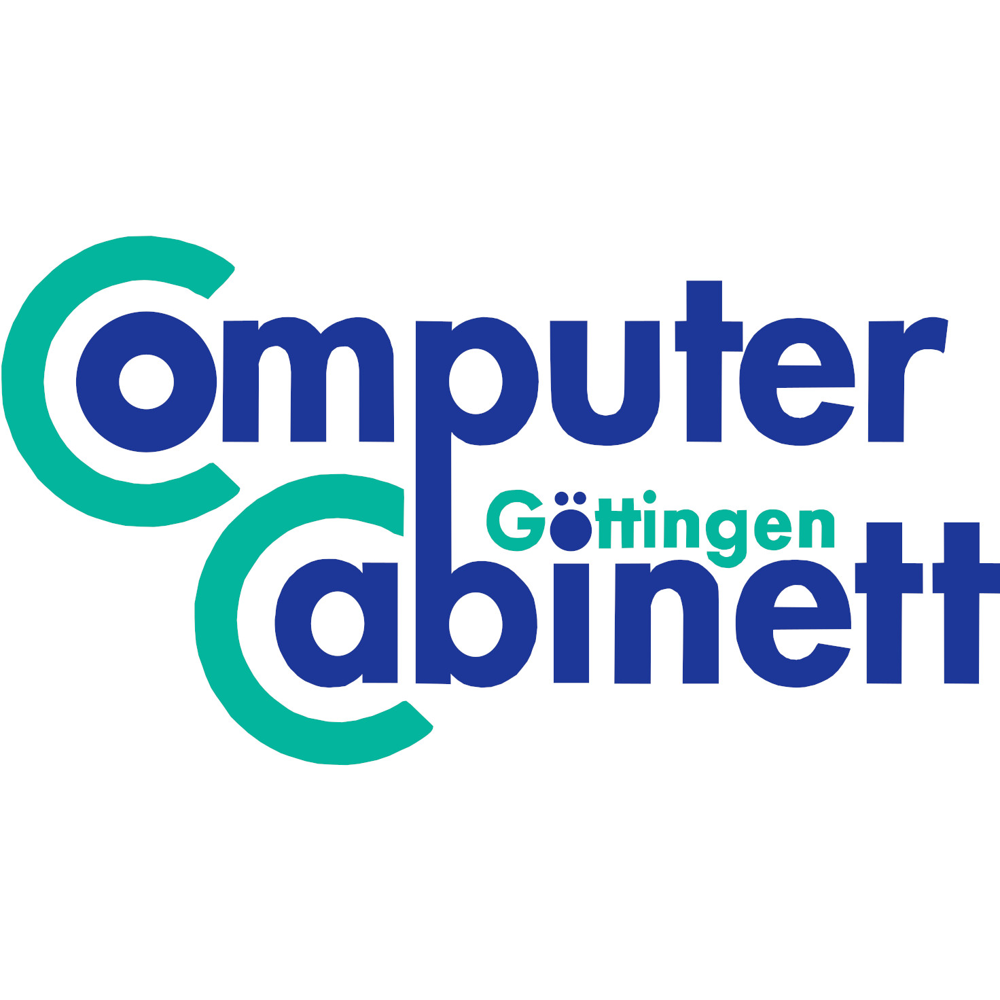

  

# Computer Cabinett Göttingen e.V. – Didaktische Konzepte der Technischen Informatik

In diesem Repository sammle ich alle Materialien, Skripte und Dokumentationen, die ich im Rahmen meiner Tätigkeit für das Computer Cabinett Göttingen e.V. erstellt habe. Ziel ist es, verständliche, didaktische Ansätze zu entwickeln, um komplexe Themen der Technischen Informatik zugänglich zu machen.

# Inhalt:
- CMOS: enthält ein CMOS RS-Latch Exponat mit einführender Erklärung

# Lizenz
Dieses Repository von Michael Krause ist unter den Bedingungen der GPLv3 lizenziert, sofern es keine abweichenden Angaben gibt. Ausgeschlossen von dieser Lizenz sind Logos, eingetragene Markennamen oder ähnliches, die bereits eine eigenständige Lizenz verfügen.